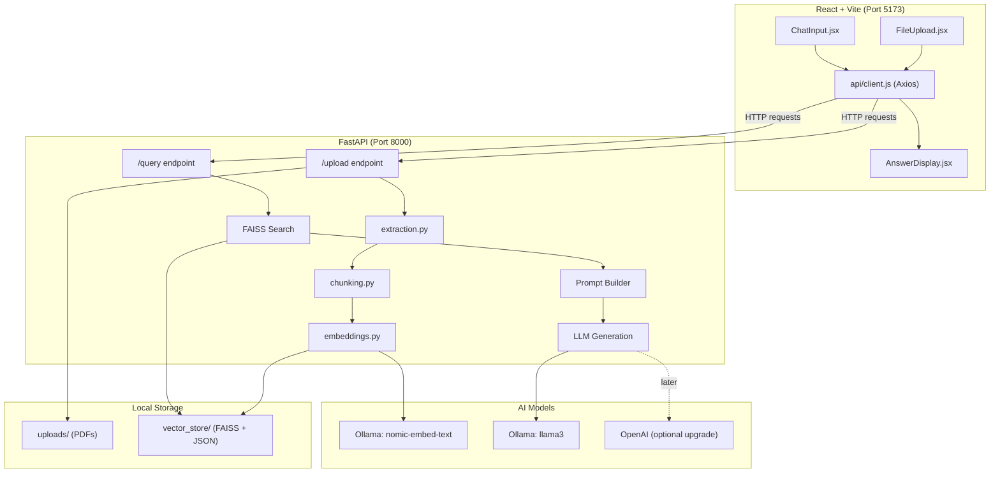

# 📄 Sourcely - RAG-Powered PDF Research Assistant

An AI-powered research assistant that allows users to upload PDF documents and ask questions about their content. Sourcely uses Retrieval-Augmented Generation (RAG) to provide accurate answers with direct citations from the uploaded source.

## ✨ Features

- **📂 smart parsing**: extract text from pdf documents.
- **🔍 vector search**: high-performance document retrieval using faiss.
- **💬 ai answers**: answers questions using local ollama models.
- **📍 citations**: provides source citations for every answer.

## 🏗️ Architecture Overview

## 🚀 Getting Started

The project is split into two main parts. Follow the instructions in each directory:

- [Backend Setup](./backend/README.md) - python, fastapi, and ollama.
- [Frontend Setup](./frontend/README.md) - react, vite, and tailwind.

## 💻 Tech Stack

- **backend**: fastapi, pdfminer, faiss, langchain.
- **frontend**: react 19, vite, tailwind css, axios.
- **llm**: local inference powered by ollama.

## 💡 Troubleshooting

- **PDF Extraction Failed**: Ensure the PDF is not password-protected or purely image-based (OCR not currently supported).
- **Ollama Connection Error**: Verify that Ollama is running (`ollama serve`) and the model is pulled (`ollama pull llama3`).
- **Memory Issues**: Large PDFs may require significant RAM for embedding generation.

## 📝 License

MIT License - feel free to use and modify!

---

**Note**: This project is designed for local research and document analysis. Ensure you have the rights to the documents you upload.
