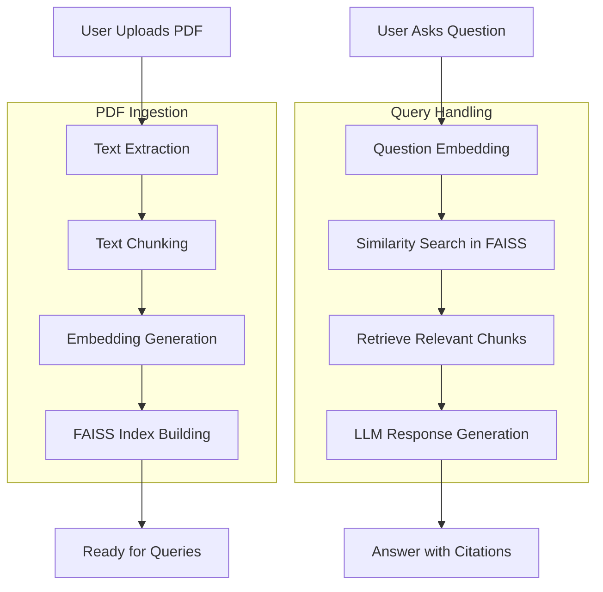

# 📄 Sourcely - RAG-Powered PDF Research Assistant

An AI-powered research assistant that allows users to upload PDF documents and ask questions about their content. Sourcely uses Retrieval-Augmented Generation (RAG) to provide accurate answers with direct citations from the uploaded source.


## ✨ Features

- **📂 PDF Upload & Processing**: Seamlessly upload and extract text from local PDF files.
- **✂️ Intelligent Chunking**: Automatically breaks down large documents into manageable segments for precise retrieval.
- **🔍 Vector-Based Search**: Uses FAISS for high-performance similarity search within document embeddings.
- **💬 RAG Question Answering**: Get LLM-generated answers based strictly on the context of your uploaded documents.
- **📍 Precise Citations**: Every answer includes citations pointing back to the specific chunks used for the response.
- **⚡ Real-time Feedback**: Live status updates during the PDF processing pipeline.

## 🎯 How It Works

### The Sourcely Processing Pipeline



## 🚀 Quick Start

### Prerequisites

- Python 3.10+
- Node.js 18+
- Ollama (running locally with your preferred model, e.g., llama3)

### Backend Setup

1. **Navigate to the backend directory:**
   ```bash
   cd backend
   ```

2. **Create and activate a virtual environment:**
   ```bash
   python -m venv venv
   source venv/bin/activate  # On Windows: venv\Scripts\activate
   ```

3. **Install dependencies:**
   ```bash
   pip install -r requirements.txt
   ```

4. **Configure environment variables:**
   Create a `.env` file in the `backend/` directory:
   ```env
   # Add any required configuration here
   ```

5. **Run the FastAPI server:**
   ```bash
   python main.py
   ```
   The API will be available at `http://localhost:8000`

### Frontend Setup

1. **Navigate to the frontend directory:**
   ```bash
   cd frontend
   ```

2. **Install dependencies:**
   ```bash
   npm install
   ```

3. **Run the development server:**
   ```bash
   npm run dev
   ```
   The application will be available at `http://localhost:5173`

## 📁 Project Structure

```text
Sourcely/
├── backend/
│   ├── main.py             # FastAPI entry point & routes
│   ├── extraction.py       # PDF text extraction logic
│   ├── chunking.py         # Text segmentation strategies
│   ├── embeddings.py       # FAISS index & embedding utilities
│   ├── generation.py       # RAG logic & LLM interaction
│   ├── requirements.txt    # Python dependencies
│   └── uploads/            # Temporary storage for PDFs
├── frontend/
│   ├── src/
│   │   ├── App.jsx         # Main UI & routing
│   │   ├── components/     # Reusable UI components
│   │   ├── api/            # API client services
│   │   └── assets/         # Images & styles
│   ├── package.json        # Frontend dependencies
│   └── vite.config.js      # Vite configuration
└── README.md
```

## 🔌 API Endpoints

| Method | Endpoint | Description |
| :--- | :--- | :--- |
| GET | `/health` | Check if the service is running |
| GET | `/status` | Check the current status of the index |
| POST | `/upload` | Upload and process a PDF file |
| POST | `/query` | Ask a question based on indexed content |

## 💻 Tech Stack

- **Backend**: FastAPI, PDFMiner, FAISS, LangChain (or custom RAG logic)
- **Frontend**: React 19, Vite, Tailwind CSS, Axios
- **LLM**: Powered by Ollama (local inference)

## 💡 Troubleshooting

- **PDF Extraction Failed**: Ensure the PDF is not password-protected or purely image-based (OCR not currently supported).
- **Ollama Connection Error**: Verify that Ollama is running (`ollama serve`) and the model is pulled (`ollama pull llama3`).
- **Memory Issues**: Large PDFs may require significant RAM for embedding generation.

## 📝 License

MIT License - feel free to use and modify!

---

**Note**: This project is designed for local research and document analysis. Ensure you have the rights to the documents you upload.
