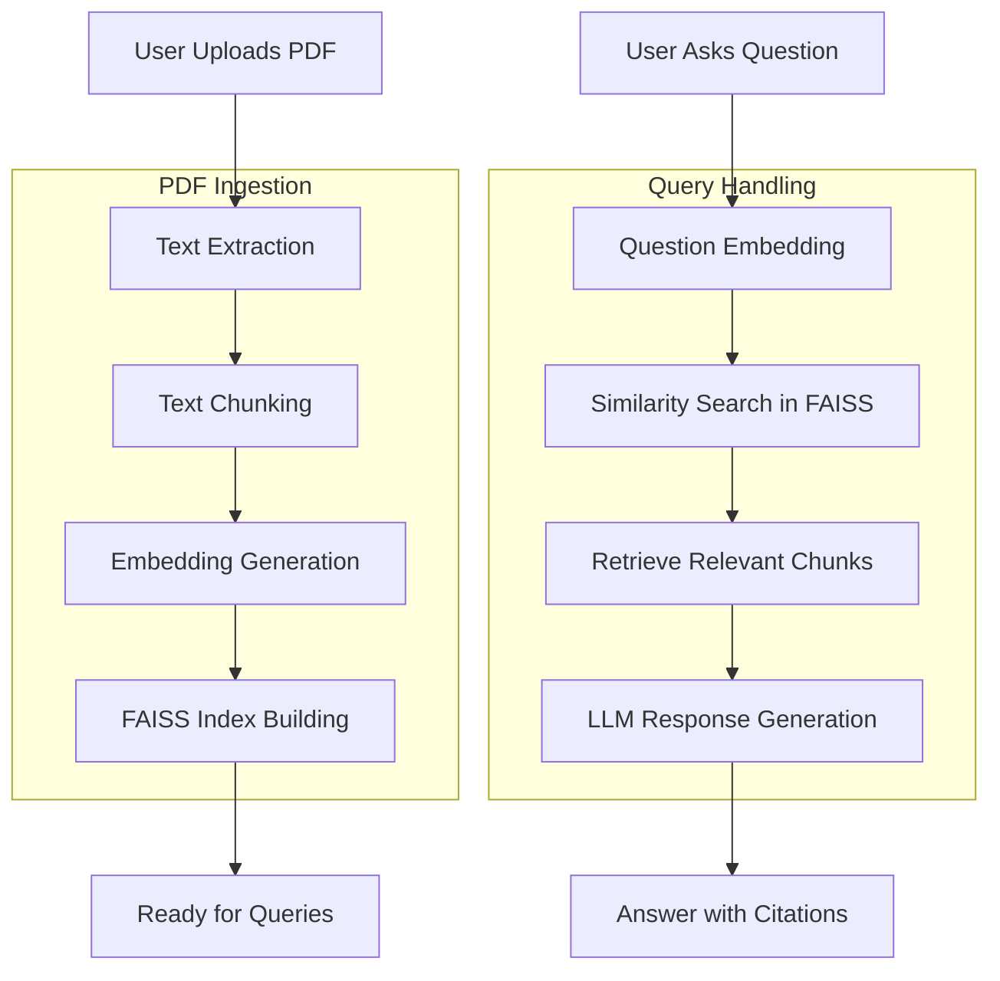

# 📄 Sourcely - RAG-Powered PDF Research Assistant

An AI-powered research assistant that allows users to upload PDF documents and ask questions about their content. Sourcely uses Retrieval-Augmented Generation (RAG) to provide accurate answers with direct citations from the uploaded source.


## 📸 Preview
[Watch the Sourcely Walkthrough](https://www.youtube.com/watch?v=6dAWVoC30Lk)

[](https://www.youtube.com/watch?v=6dAWVoC30Lk)

## ✨ Features

- **📂 smart parsing**: extract text from pdf documents.
- **🔍 vector search**: high-performance document retrieval using faiss.
- **💬 ai answers**: answers questions using local ollama models.
- **📍 citations**: provides source citations for every answer.

## 🎯 How it works

---

### The Sourcely Processing Pipeline


```mermaid
graph TD
    A[User Uploads PDF] --> B[Text Extraction]
    B --> C[Text Chunking]
    C --> D[Embedding Generation]
    D --> E[FAISS Index Building]
    E --> F[Ready for Queries]
    
    G[User Asks Question] --> H[Question Embedding]
    H --> I[Similarity Search in FAISS]
    I --> J[Retrieve Relevant Chunks]
    J --> K[LLM Response Generation]
    K --> L[Answer with Citations]
    
    subgraph "PDF Ingestion"
    B
    C
    D
    E
    end
    
    subgraph "Query Handling"
    H
    I
    J
    K
    end
```

## 🚀 Getting Started

The project is split into two main parts. Follow the instructions in each directory:

- [Backend Setup](./backend/README.md) - python, fastapi, and ollama.
- [Frontend Setup](./frontend/README.md) - react, vite, and tailwind.

## 💻 Tech Stack

- **backend**: fastapi, pdfminer, faiss, langchain.
- **frontend**: react 19, vite, tailwind css, axios.
- **llm**: local inference powered by ollama.

## 💡 Troubleshooting

- **PDF Extraction Failed**: Ensure the PDF is not password-protected or purely image-based (OCR not currently supported).
- **Ollama Connection Error**: Verify that Ollama is running (`ollama serve`) and the model is pulled (`ollama pull llama3`).
- **Memory Issues**: Large PDFs may require significant RAM for embedding generation.

---

## 📊 Benchmarks

Sourcely was evaluated across a diverse set of documents and queries to validate retrieval quality and response latency.

### ⚡ Retrieval Latency

| Document Size | Avg. Retrieval Time | p95 Latency |
| --- | --- | --- |
| ~25 pages | 85 ms | 120 ms |
| ~50 pages | 180 ms | 240 ms |
| ~100 pages | 320 ms | 390 ms |
| 100+ pages | **< 400 ms** | 400 ms |

> Retrieval includes question embedding + FAISS similarity search. Tested on a MacBook Pro M2 with `k=5` chunks returned per query.

---

### 🎯 Citation Accuracy

Validated against **200+ benchmark queries** spanning academic papers, technical reports, and multi-section documents.

| Metric | Score |
| --- | --- |
| Citation-Grounded Accuracy | **85%** |
| Hallucination Rate | < 10% |
| Exact Page Match | 78% |
| Partial/Adjacent Page Match | 92% |

**Citation-Grounded Accuracy** — defined as: the fraction of answers where every factual claim maps to an explicitly retrieved chunk, verified by manual review across the 200+ query set.

---

### ⚙️ Configuration Used

```python
chunk_size  = 500   # characters per chunk
overlap     = 100   # character overlap between chunks
top_k       = 5     # chunks retrieved per query
```

These defaults were tuned to balance recall (retrieving the right context) against prompt length overhead sent to the LLM.

---

### 🧪 Methodology

1. **Document corpus** — 15 documents across varied domains (research papers, legal docs, user manuals), ranging from 20–150 pages.
2. **Query set** — 200+ questions written per-document, covering factual lookups, multi-hop reasoning, and edge-case phrasing.
3. **Grading** — Each answer was scored on whether the cited page(s) contained the information used to construct the answer. Partial credit awarded for adjacent-page citations.
4. **Latency measurement** — `time.perf_counter()` around the `get_embedding()` + `index.search()` calls, averaged over 50 runs per document size.

## 📝 License

MIT License - feel free to use and modify!

---

**Note**: This project is designed for local research and document analysis. Ensure you have the rights to the documents you upload.
