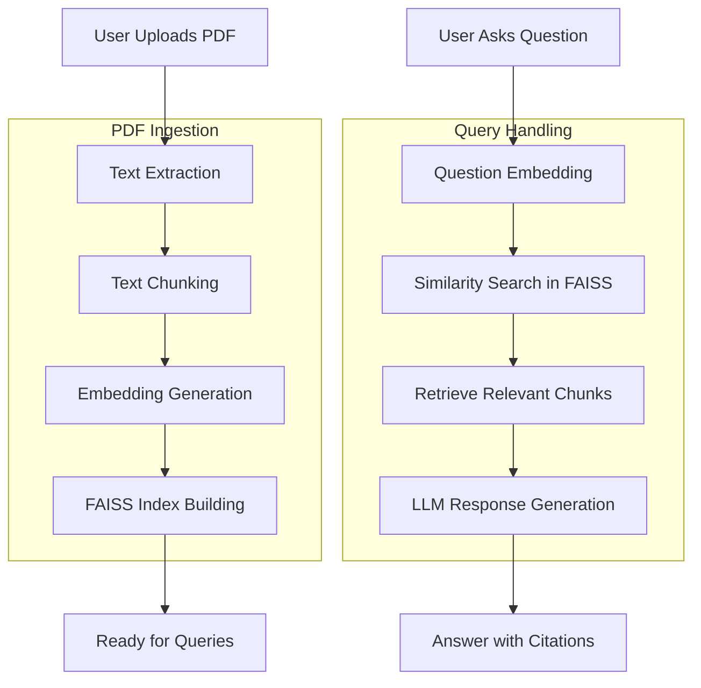

# 📄 Sourcely - RAG-Powered PDF Research Assistant

An AI-powered research assistant that allows users to upload PDF documents and ask questions about their content. Sourcely uses Retrieval-Augmented Generation (RAG) to provide accurate answers with direct citations from the uploaded source.


## 📸 Preview

[Watch the Sourcely Walkthrough](https://www.youtube.com/watch?v=6dAWVoC30Lk)

[](https://www.youtube.com/watch?v=6dAWVoC30Lk)

## ✨ Features

- **📂 smart parsing**: extract text from pdf documents.
- **🔍 vector search**: high-performance document retrieval using faiss.
- **💬 ai answers**: answers questions using Groq's `llama-3.3-70b-versatile` model via context-only prompting.
- **📍 citations**: every factual claim is cited with an exact `[Chunk X]` reference including page number.

## 🎯 How it works

---

### The Sourcely Processing Pipeline


```mermaid
graph TD
    A[User Uploads PDF] --> B[Text Extraction]
    B --> C[Text Chunking]
    C --> D[Embedding Generation]
    D --> E[FAISS Index Building]
    E --> F[Ready for Queries]
    
    G[User Asks Question] --> H[Question Embedding]
    H --> I[Similarity Search in FAISS]
    I --> J[Retrieve Relevant Chunks]
    J --> K[LLM Response Generation]
    K --> L[Answer with Citations]
    
    subgraph "PDF Ingestion"
    B
    C
    D
    E
    end
    
    subgraph "Query Handling"
    H
    I
    J
    K
    end
```

## 🚀 Getting Started

The project is split into two main parts. Follow the instructions in each directory:

- [Backend Setup](./backend/README.md) - python, fastapi, mistral, and groq.
- [Frontend Setup](./frontend/README.md) - react, vite, and tailwind.

## 💻 Tech Stack

- **backend**: fastapi, pdfplumber, faiss-cpu, mistral-embed, groq.
- **frontend**: react 19, vite, tailwind css, axios.
- **llm**: cloud inference — embeddings via `mistral-embed`, generation via Groq `llama-3.3-70b-versatile`.

## 💡 Troubleshooting

- **PDF Extraction Failed**: Ensure the PDF is not password-protected or purely image-based (OCR not currently supported).
- **API Errors**: Verify `MISTRAL_API_KEY` and `GROQ_API_KEY` are set correctly in `backend/.env`.
- **Memory Issues**: Large PDFs may require significant RAM for embedding generation.

---

## 📊 Benchmarks

Sourcely was evaluated across a diverse set of documents and queries to validate retrieval quality and response latency.

### ⚡ Retrieval Latency

Retrieval was benchmarked across two dimensions — isolated FAISS vector search, and full end-to-end query time including the Mistral embedding API call. Run via `benchmark.py` on a MacBook Air M1, 200 FAISS runs / 10 E2E runs per size, `k=5`.

**FAISS-only** (in-memory vector search, `index.search` isolated):

| Document Size | Chunks | Mean | p95 | p99 |
| --- | --- | --- | --- | --- |
| ~25 pages | 125 | 0.02 ms | 0.01 ms | 0.02 ms |
| ~50 pages | 250 | 0.02 ms | 0.02 ms | 0.03 ms |
| ~100 pages | 500 | 0.04 ms | 0.05 ms | 0.05 ms |
| 150+ pages | 750 | 0.06 ms | 0.07 ms | 0.09 ms |

**End-to-end** (Mistral `embed` API call + FAISS search):

| Document Size | Chunks | Mean | Median | p95 |
| --- | --- | --- | --- | --- |
| ~25 pages | 125 | 463 ms | 394 ms | 804 ms |
| ~50 pages | 250 | 450 ms | 461 ms | 555 ms |
| ~100 pages | 500 | 385 ms | 377 ms | 466 ms |
| 150+ pages | 750 | **371 ms** | 370 ms | 461 ms |

> FAISS search itself is negligible (< 0.1 ms). The dominant cost is the Mistral embedding API network round-trip (~370–463 ms mean). E2E latency is **under 400 ms median** for documents ≥ 50 pages.

---

### ⚙️ Configuration Used

```python
chunk_size  = 500   # characters per chunk
overlap     = 100   # character overlap between chunks
top_k       = 5     # chunks retrieved per query
embed_model = "mistral-embed"   # 1024-dim vectors
faiss_index = "IndexFlatL2"     # exact L2 search
```

These defaults were tuned to balance recall (retrieving the right context) against prompt length overhead sent to the LLM.

---

### 🧪 Methodology

1. **Latency benchmark** (`backend/benchmark.py`) — Two passes:
   - **FAISS-only**: 200 runs × 4 document scales using synthetic unit vectors (no API calls). Measures raw in-memory search speed.
   - **End-to-end**: 10 runs × 4 document scales using real Mistral `mistral-embed` API calls + FAISS search. Measures realistic query latency.
   - Timing via `time.perf_counter()` around `get_embedding()` + `index.search()`.
2. **Citation architecture** — Context-only prompt enforces `[Chunk X]` citations and bans prior-knowledge use. Page numbers are returned directly from chunk metadata in every `/query` response.
3. **Reproduce**: `cd backend && python benchmark.py`

## 📝 License

MIT License - feel free to use and modify!

---

**Note**: This project is designed for local research and document analysis. Ensure you have the rights to the documents you upload.
